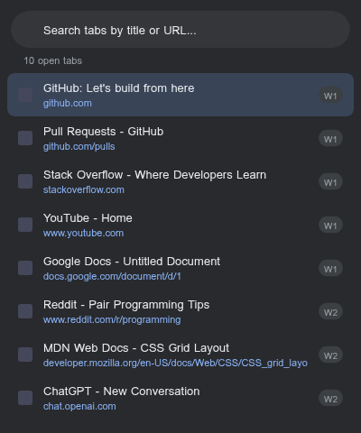
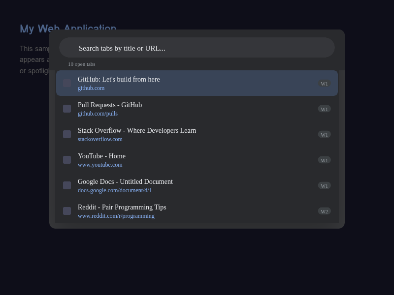
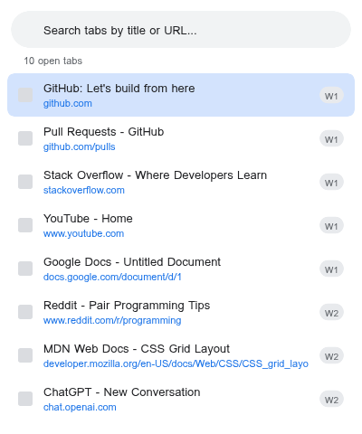
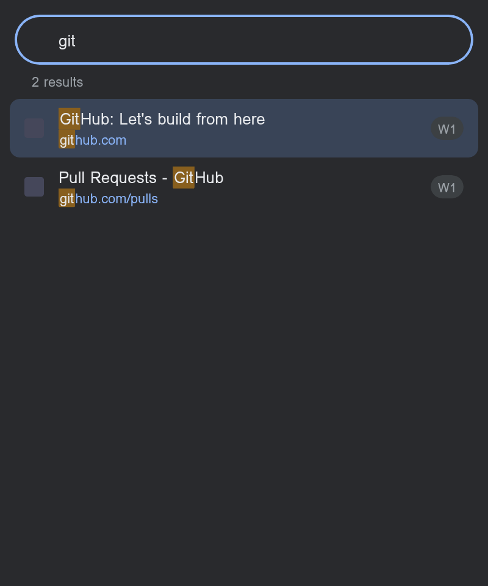
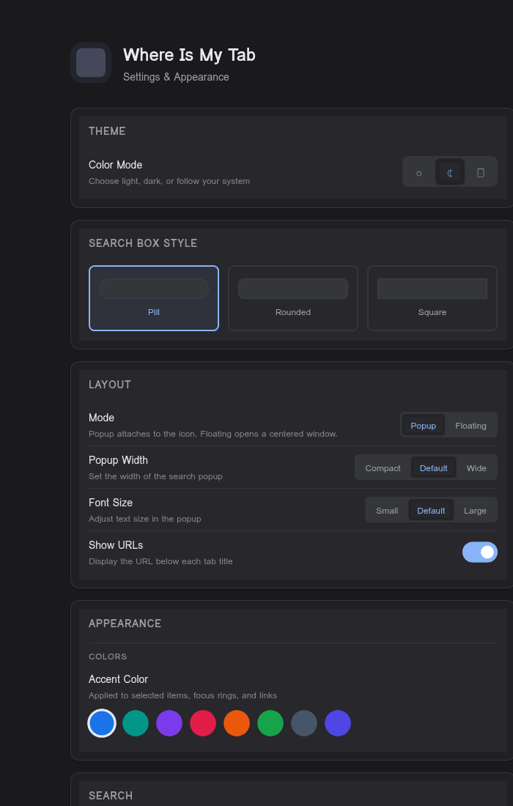

# Where Is My Tab — Full Feature Guide

A Chrome extension for instantly searching and switching between open tabs across all windows.

---

## Opening the Extension

There are three ways to open Where Is My Tab:

1. **Keyboard shortcut**: Press `Ctrl+Shift+F` (default) to instantly open the tab search.
2. **Toolbar icon**: Click the Where Is My Tab icon in the Chrome toolbar.
3. **Custom shortcut**: Change the activation shortcut at `chrome://extensions/shortcuts`.

Once opened, the search input is automatically focused so you can start typing immediately.

---

## Layout Modes

Where Is My Tab supports two layout modes, configurable in Settings.

### Popup Mode (Default)

The standard Chrome extension popup that appears anchored to the toolbar icon. It displays a search bar at the top, a tab count, and a scrollable list of all open tabs.

### Floating Mode

A centered overlay window that appears on top of the current page, similar to a launcher or spotlight search. It has a blurred backdrop and a larger display area (680x520px). Click the backdrop or press Escape to dismiss it.

---

## Themes

The extension supports three color modes, configurable in Settings under **Theme > Color Mode**.

### Dark Theme

### Light Theme

### System Theme

Automatically follows your operating system's light/dark preference.

---

## Search

Type in the search bar to filter tabs in real time. The search matches against tab titles and URLs, with results ranked by relevance.

- Title matches are weighted higher than URL matches
- Matches at the beginning of a title or URL score bonus points
- Multiple search terms are supported (all must match)
- Matching text is highlighted in the results

### Content Search

When enabled in Settings, the extension also searches inside page text (not just titles and URLs). Page content is extracted progressively in batches when the popup opens. This requires the `scripting` permission and only works on standard web pages (not `chrome://` or extension pages).

---

## Tab List

Each tab entry in the list displays:

- **Favicon**: The site icon (or a fallback "?" icon if unavailable)
- **Title**: The tab's page title, with search term highlights
- **URL**: The stripped URL (host + path), shown below the title (can be toggled off)
- **Window badge**: A `W1`, `W2`, etc. badge indicating which window the tab belongs to (only shown when multiple windows are open)
- **Close button**: An X button on hover to close the tab directly (when enabled)

### Keyboard Navigation

| Action | Key |
|---|---|
| Navigate results | Arrow Up / Arrow Down |
| Switch to selected tab | Enter |
| Close popup | Escape |

The list uses virtual scrolling for performance, rendering only the visible items. This keeps the popup fast even with hundreds of open tabs.

---

## Settings

Right-click the extension icon and select **Options**, or search "settings" in the tab search to open the settings page.

### Live Preview

At the top of the settings page is a live preview card that reflects your current configuration in real time. It shows a mock search result list with your chosen accent color, search box style, font size, and URL visibility.

---

### Theme

| Setting | Options | Description |
|---|---|---|
| Color Mode | Light, Dark, System | Controls the overall color scheme. System follows your OS preference. |

---

### Search Box Style

Controls the border radius of the search input field.

| Style | Radius | Description |
|---|---|---|
| Pill | 24px | Fully rounded ends (default) |
| Rounded | 8px | Slightly rounded corners |
| Square | 2px | Nearly sharp corners |

---

### Layout

| Setting | Options | Description |
|---|---|---|
| Mode | Popup, Floating | Popup attaches to the toolbar icon. Floating opens a centered overlay window on the current page. |
| Popup Width | Compact (320px), Default (400px), Wide (500px) | Width of the popup. Only applies in Popup mode. |
| Font Size | Small (12px), Default (13px), Large (14px) | Text size in the tab list. |
| Show URLs | On / Off | Toggle URL display below each tab title. |

---

### Appearance

#### Animation

| Setting | Options | Description |
|---|---|---|
| Tab Hover Effect | Highlight, Glow, Slide, None | Visual effect when hovering over a tab item. |
| Tab Selection Effect | Highlight, Border Left, Scale, None | Visual effect for the currently selected/active tab item. |

#### Colors

| Setting | Options | Description |
|---|---|---|
| Accent Color | 8 presets + custom picker | Applied to selected items, focus rings, URLs, and links. Presets: Chrome Blue, Teal, Purple, Rose, Orange, Green, Slate, Indigo. |
| Background Color | 8 presets + custom picker | Base background color. Presets: Dark, Charcoal, Navy, Midnight, Graphite, White, Light Gray, Warm Gray. |
| Background Opacity | 20%–100% slider | Transparency level of the popup background. Only applies in Popup mode. |

Each color section has a **Default** button to reset to the original value.

---

### Search

| Setting | Options | Description |
|---|---|---|
| Content Search | On / Off | Search inside page text, not just title and URL. Extracts text when popup opens. Off by default. |
| Max Results | 50, 100, 200, 500 | Limit the number of search results for faster rendering. Default: 100. |
| Default Sort | Recent, Alphabetical, Window | Tab order when no search query is active. Recent uses Chrome's default order, Alphabetical sorts by title, Window groups by window ID. |

---

### Tab Management

| Setting | Options | Description |
|---|---|---|
| Close Button | On / Off | Show an X button on hover to close tabs directly from the popup. Off by default. |

---

### Keyboard Shortcuts

The settings page displays the current shortcut bindings:

| Action | Default Shortcut |
|---|---|
| Open tab search | Ctrl+Shift+F |
| Navigate results | Arrow Up / Down |
| Switch to tab | Enter |
| Close popup | Escape |

The activation shortcut can be changed at `chrome://extensions/shortcuts` (linked from the settings page).

---

## Permissions

| Permission | Reason |
|---|---|
| `tabs` | Read tab titles, URLs, and favicons to populate the search list |
| `storage` | Save user settings (theme, accent color, layout, etc.) |
| `scripting` | Extract page content for Content Search feature |
| `<all_urls>` (host) | Required by `scripting` to inject content extraction on any page |
